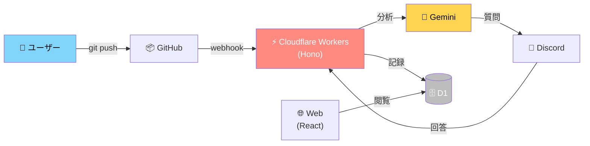

# seedlog

エンジニア学生の学びを「勝手に記録される」体験へ

---

# 課題：エンジニア学生が抱える3つの悩み

- **LTネタが思いつかない**
  - 何を話せばいいかわからない

- **技術記事が書けない**
  - ネタが浮かばない、まとめられない

- **就活ESで話す経験がない**
  - 「この学習で何を得たか」言語化できない

---

## 本質的な課題

```
よし、動いた。次やろう
        ↓
    [記録なし]
        ↓
  1ヶ月後に忘れてる
```

**根本原因：日々の学びを記録していないから振り返れない**

---

## なぜ記録しないのか？

プログラマーの行動心理：

1. コード実行 → 「よし、動いた 🎉」
2. 達成感で脳が満足
3. 次のタスクに移動
4. ~~記録なんて後でいいや~~ → **後で必ず忘れる**

**問題点：記録は「面倒な作業」に見えてる**

---

## 既存ツールとの限界

| ツール            | 特徴                 | 制限                       |
| ----------------- | -------------------- | -------------------------- |
| **Notion AI**     | 文章をまとめてくれる | **記録がある人向け**       |
| **Claude Code**   | 質問に答えてくれる   | **主体的に使う必要がある** |
| **Github Issues** | 手動で作成           | **自分でまとめる手間**     |

**共通点：全部、自分で「記録する」必要がある**

---

## 解決策：コアコンセプト

### 「勝手に記録される」体験

```
GitHub に push
         ↓
  AI が質問を生成
         ↓
  一言答えるだけ
         ↓
  ✨ 自動で記録完成 ✨
```

ユーザーは「答える」だけ。記録は勝手にできていく。

---

## 仕組みの説明

```
┌─────────────────────────────────────────┐
│  1️⃣  GitHub に push                      │
│      (通常のワークフロー)                  │
└──────────────┬──────────────────────────┘
               ↓
┌─────────────────────────────────────────┐
│  2️⃣  seedlog が webhook で検知            │
│      コミット情報を取得                    │
└──────────────┬──────────────────────────┘
               ↓
┌─────────────────────────────────────────┐
│  3️⃣  AI が「この変更は何？」を質問         │
│      Discord に通知                      │
└──────────────┬──────────────────────────┘
               ↓
┌─────────────────────────────────────────┐
│  4️⃣  ユーザーが一言返信                    │
│      「〇〇の機能を追加」                  │
└──────────────┬──────────────────────────┘
               ↓
┌─────────────────────────────────────────┐
│  5️⃣  自動で学習記録として保存              │
│      「いつ」「何を」「なぜ」の形で        │
└─────────────────────────────────────────┘
```

---

## スクリーンショット

実際の使用画面：

- Discord での質問と回答
- seedlog での学習記録の自動生成
- GitHub との連携フロー

（スクリーンショットはここに配置予定）

---

## ユースケース

1. **LT（ライトニングトーク）**
   - 「この3ヶ月で何やった？」が即座に答えられる

2. **技術記事執筆**
   - 記録から良い話題を選んで展開

3. **就活ES・面接**
   - 「この学習で何を得たか」が明確に答えられる

4. **チーム内振り返り**
   - メンバーの学習状況が可視化される

---

## 技術スタック



**GitHub へのコミット → AI が自動質問 → Discord で回答 → 自動記録**

---

## まとめ

### これまで：「自分で記録する」

❌ 面倒→続かない→忘れる

### これから：「勝手に記録される」

✅ 質問に答えるだけ→気づいたら記録される→振り返れる

**seedlog で、エンジニア学生の学びを可視化する。**

---
layout: cover
---

# ありがとうございました！

Questions?
